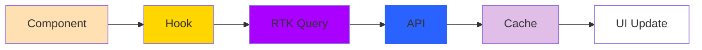

## Presentation on 18-02-2026

### 1. តើ Redux និង Redux Toolkit ខុសគ្នាដូចម្ដេច?

##### Redux (Classic Redux) : គឺជា state management library សម្រាប់រក្សាទុក global state (auth, theme, cart, user...)

ប៉ុន្តែ Redux ដើមមានបញ្ហា ៖
- Boilerplate code ច្រើន
- ត្រូវសរសេរ action, reducer, type, store ដោយខ្លួនឯង
- Setup ពិបាក
##### Redux Toolkit (RTK)

Redux Toolkit គឺជា official modern Redux ដែលធ្វើឲ្យ Redux ងាយប្រើ​ ។

អត្ថប្រយោជន៍៖
- Boilerplate តិច
- Setup ងាយ
- មាន built-in tools (createSlice, createAsyncThunk, RTK Query)


---

### 2. តើ Redux Toolkit ដំណើរការដូចម្ដេច?

របៀបដែល Redux Toolkit ដំណើរការ
```bash
Component → dispatch(action) → reducer → update store → UI re-render
```

នៅក្នុង RTK​ ៖
- CreateSlice -> Create reducer + action, logic
- ConfigureStore -> Create Store
- useSelector -> read state
- useDispatch -> send action

> Redux Toolkit ប្រើ Immer → អាច mutate state ដោយសុវត្ថិភាព


**Example** 

1. Setup Folder Structure 
```bash
/store
   index.ts // store.ts
   hooks.ts // យើងអាចបង្កើតនៅ folder hook ហើយផ្ទុកនៅ file មួយនេះ
   /slice
       counterSlice.ts
/app
   layout.tsx
   page.tsx
```
2. Create slice `store/slice/counterSlice.ts`

```ts
import { createSlice } from "@reduxjs/toolkit";

type CounterState = {
  value: number;
};

const initialState: CounterState = {
  value: 0
};

const counterSlice = createSlice({
  name: "counter", // must be the same
  initialState, // { value: 0 }
  reducers: {
    increment: (state) => {
      state.value += 1; // Immer → safe mutate
    },
    decrement: (state) => {
      state.value -= 1;
    },
    incrementByAmount: (state, action) => {
      state.value += action.payload;
    }
  }
});

export const { increment, decrement, incrementByAmount } =
  counterSlice.actions;

export default counterSlice.reducer;
```

3. Create Store `store/index.ts`

```ts
import { configureStore } from "@reduxjs/toolkit";
import counterReducer from "./slice/counterSlice";

export const store = configureStore({
  reducer: {
    counter: counterReducer // must be the same
  }
});

// Types(Important) for TS
export type RootState = ReturnType<typeof store.getState>;
export type AppDispatch = typeof store.dispatch;
```


4. Typed Hooks (Best Practice) `store/hooks.ts` 

យើងមិនប្រើប្រាស់នៅ hook ក៏បានដែរ


You can use raw hooks:
```tsx
import { useSelector, useDispatch } from "react-redux";
```

នៅក្នុង component 
```tsx
const count = useSelector((state: any) => state.counter.value);
const dispatch = useDispatch();
```
✔ Redux still works
✔ Selector still works
✔ Dispatch still works

Because TypeScript safety + cleaner code

Without hooks.ts:
- state becomes any
- No autocomplete
- Can make mistakes

with hook.ts
```ts
export const useAppDispatch = () => useDispatch<AppDispatch>();
export const useAppSelector: TypedUseSelectorHook<RootState> = useSelector;
```


then : 
```tsx
const count = useAppSelector((state) => state.counter.value);
const dispatch = useAppDispatch();
```

Benefits:
- Full TypeScript typing
- Autocomplete
- Safer code
- Cleaner imports


`hook.ts`
```ts
import { TypedUseSelectorHook, useDispatch, useSelector } from "react-redux";
import type { RootState, AppDispatch } from "./index";

export const useAppDispatch = () => useDispatch<AppDispatch>();
export const useAppSelector: TypedUseSelectorHook<RootState> = useSelector;
```

5. Provide Store to App `app/layout.tsx`

```tsx
"use client";

import { Provider } from "react-redux";
import { store } from "@/store";

export default function RootLayout({
  children
}: {
  children: React.ReactNode;
}) {
  return (
    <html>
      <body>
        <Provider store={store}>{children}</Provider>
      </body>
    </html>
  );
}
```

6. Use Redux Toolkit in Component `app/page.tsx`

```tsx
"use client";

import {
  increment,
  decrement,
  incrementByAmount
} from "@/store/slice/counterSlice";
import { useAppDispatch, useAppSelector } from "@/store/hooks";

export default function Page() {
  const count = useAppSelector((state) => state.counter.value);
  const dispatch = useAppDispatch();

  return (
    <div style={{ padding: 20 }}>
      <h1>Redux Toolkit Flow Example</h1>
      <h2>Count: {count}</h2>

      <button onClick={() => dispatch(increment())}>+1</button>
      <button onClick={() => dispatch(decrement())}>-1</button>
      <button onClick={() => dispatch(incrementByAmount(5))}>
        +5
      </button>
    </div>
  );
}
```


> You don’t need StoreProvider if your store is simple and client-only
> You should use StoreProvider when using Next.js App Router + Server Components + SSR + per-request store


> Why sometimes NOT using StoreProvider works?

In my example:
```tsx
<Provider store={store}>{children}</Provider>
```
- Store is single global store
- Runs only in client
- No SSR / no server state
- Simple app → OK

> When you MUST use StoreProvider (Recommended in real apps)

Use StoreProvider when:
- Using Next.js App Router (Server + Client mix) ⚠️
- Need per-request store (SSR safe)
- Avoid store sharing between users
- Want scalable architecture

Example store provider : `store/StoreProvider.tsx`
```bash
"use client";

import { Provider } from "react-redux";
import { store } from "./index";

export default function StoreProvider({
  children
}: {
  children: React.ReactNode;
}) {
  return <Provider store={store}>{children}</Provider>;
}
```

Use in layout
```bash
import StoreProvider from "@/store/StoreProvider";

export default function RootLayout({
  children
}: {
  children: React.ReactNode;
}) {
  return (
    <html>
      <body>
        <StoreProvider>{children}</StoreProvider>
      </body>
    </html>
  );
}
```


---


### 3. តើ RTK Query គឺជាអ្វី?


**RTK Query** គឺជា tool មួយនៅក្នុង Redux Toolkit ដែលជួយយើង fetch data ពី API និងគ្រប់គ្រង state ដោយស្វ័យប្រវត្តិ ។

និយាយសាមញ្ញ -> `RTK Query = Tool សម្រាប់ call API + cache + loading + error + update UI ដោយមិនចាំបាច់សរសេរ code ច្រើន។`

វាជួួយយើង
* Fetch data (GET)
* Create / Update / Delete (POST, PUT, DELETE)
* Cache data
* Refetch auto
* Manage loading & error state


---


### 4. ហេតុអ្វីបានជាយើងត្រូវប្រើប្រាស់ RTK Query?

មុនមាន RTK Query

យើងត្រូវសរសេរ៖
* useEffect
* useState
* dispatch action
* reducer
* loading / error state
* cache logic
> Code ច្រើន + ពិបាក maintain

ក្រោយមាន RTK Query
* Auto caching
* Auto refetch
* Auto loading / error state
* Reduce boilerplate code
* Easy CRUD with API
* Better performance
> RTK Query ធ្វើអោយ React App : clean, fast, easy maintain
> 
---

### 5. តើពេលណាដែលយើងត្រូវប្រើប្រាស់ RTK Query?

យើងគួរប្រើ RTK Query នៅពេល
* App មាន API
  * Fetch products
  * Fetch users
  * Blog / Posts
  * Dashboard data
* ត្រូវការប្រើ Cache
  * មិនចង់ fetch API ម្តងហើយម្តងទៀត
  * Improve performance
* CRUD App
  * Create post
  * Update profile
  * Delete item
* Large / Real project
  * Ecommerce
  * Admin Dashboard
  * Social Media
  * SaaS App

> បើ App តូច ឬ API តិច អាចប្រើ fetch ធម្មតាបាន
> បើ App ធំ -> RTK Query ជាជម្រើសល្អ

------

### 6. តើ RTK Query ដំណើរការដូចម្ដេច?




**Structure Project :**


##### 1. Create API Slice

អ្នកបង្កើត API slice មួយដោយ createApi
```ts
import { createApi, fetchBaseQuery } from '@reduxjs/toolkit/query/react'

export const api = createApi({
  reducerPath: 'api',
  baseQuery: fetchBaseQuery({ baseUrl: 'https://api.example.com' }),
  endpoints: (builder) => ({
    getUsers: builder.query<User[], void>({
      query: () => '/users',
    }),
  }),
})

export const { useGetUsersQuery } = api
```
នៅទីនេះ RTK Query បង្កើត:
- hook (useGetUsersQuery)
- cache
- loading / error state
- auto refetch

#### 2. Add to Store
```ts
import { configureStore } from '@reduxjs/toolkit'
import { api } from './services/api'

export const store = configureStore({
  reducer: {
    [api.reducerPath]: api.reducer,
  },
  middleware: (getDefaultMiddleware) =>
    getDefaultMiddleware().concat(api.middleware),
})
```
middleware នេះគ្រប់គ្រង:
- caching
- refetch
- invalidation
- polling

#### 3. Use Hook in Component
```tsx
const Users = () => {
  const { data, error, isLoading } = useGetUsersQuery()

  if (isLoading) return <p>Loading...</p>
  if (error) return <p>Error</p>

  return (
    <ul>
      {data?.map((u) => (
        <li key={u.id}>{u.name}</li>
      ))}
    </ul>
  )
}
```
RTK Query ធ្វើអោយ:
- Auto fetch when component mount
- Cache result
- Reuse data (no duplicate request)
- Auto re-render UI
---

### ហេតុអ្វីបានជាយើងប្រើប្រាស់នៅ StoreProvider ?

> ជាក់ស្តែង -> StoreProvider មិនមែនជារបស់ Redux ទេ វាគ្រាន់តែជា component ដែល developer បង្កើតដោយខ្លួនឯង ដើម្បី wrap `<Provider>` ប៉ុណ្ណោះ។


និយាយសាមញ្ញ៖

| ឈ្មោះ           | មកពីណា                    | អ្វីដែលវាធ្វើ              |
| --------------- | ------------------------- | -------------------------- |
| `Provider`      | react-redux (official)    | ភ្ជាប់ Redux Store ទៅ App  |
| `StoreProvider` | Custom (developer បង្កើត) | Wrap `Provider` ឲ្យប្រើងាយ |


**StoreProvider.tsx**
```tsx
'use client'

import { Provider } from 'react-redux'
import { store } from '@/app/store'

export default function StoreProvider({
  children,
}: {
  children: React.ReactNode
}) {
  return <Provider store={store}>{children}</Provider>
}
```

**Laybout.tsx**
```tsx
import StoreProvider from './StoreProvider'

export default function RootLayout({
  children,
}: {
  children: React.ReactNode
}) {
  return (
    <html lang="en">
      <body>
        <StoreProvider>
          {children}
        </StoreProvider>
      </body>
    </html>
  )
}
```


ភាគច្រើនគេប្រើប្រាស់នៅ StoreProvider ព្រោះ៖
* Client / Server Separation: 
  Redux ត្រូវដំណើរការ client side → ត្រូវមាន `'use client'` ដូច្នេះគេដាក់វាក្នុង StoreProvider ដើម្បីអោយ layout.tsx ស្អាត។
* ងាយបន្ថែម Provider ផ្សេងៗ: 

  ពេល project ធំ អ្នកអាចមាន:
  * ThemeProvider
  * AuthProvider
  * PersistProvider
  * QueryProvider
  ```tsx
    <StoreProvider>
      <ThemeProvider>
        <AuthProvider>{children}</AuthProvider>
      </ThemeProvider>
    </StoreProvider>
  ``` 
  ជំនួសដាក់គ្រប់យ៉ាងក្នុង layout.tsx (ដែលធ្វើអោយ code រញ៉េរញ៉ៃ)

* Advanced (Store per request): ក្នុង Next.js advanced usage → មួយ request អាចត្រូវការបង្កើត store ថ្មី StoreProvider ជួយគ្រប់គ្រង logic នេះបានល្អ។
 
  (ភាគច្រើន project មិនទាន់ត្រូវការ)


--- 
### Injecting Endpoints vs Enhancing Endpoints

* [redux-toolkit](https://redux-toolkit.js.org/rtk-query/usage/code-splitting)
* 