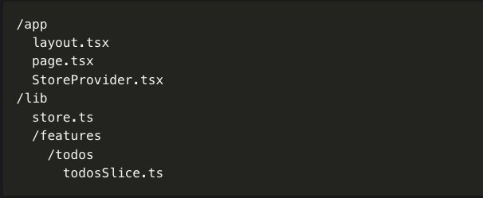

```bash
/app
  layout.tsx 
  page.tsx
  StoreProvider.tsx
/lib
  store.ts
  /features
    /todos
      todosSlice.ts
```


createSlice → For Local / UI State
- Use slice when managing:
- modal open/close
- dark mode
- counter
- form state
- selected user
- authentication state
- anything NOT directly fetched from server

createApi (RTK Query) → For Server Data
- Use API when:
- Fetching from backend
- POST / PUT / DELETE requests
- Caching server responses
- Auto refetching
- Handling loading & error automatically

| Slice                 | API                  |
| --------------------- | -------------------- |
| Manages local state   | Manages server state |
| No automatic fetching | Automatic fetching   |
| No caching            | Has caching          |
| No loading state      | Built-in loading     |
| No error handling     | Built-in error       |

- api → fetch users
- slice → manage selected user / modal state